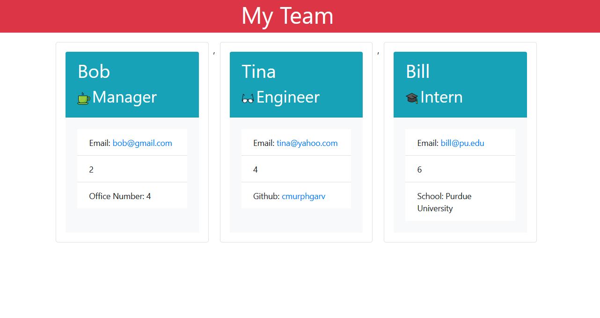

# Team-Profile-Generator

## Description

Command-line application which generates an HTML document styled with Bootstrap that contains one card for each employee entered, including their name, role, employee ID, email, and additional information specific to their role. For managers it also includes an office number, for engineers a link to their github with their username, and for student interns the name of their school.

## Preview

## Installation

npm install in the command line to install all necessary packages

## Usage

For creating a shareable HTML document which lays out information on multiple employees in an accessible format and which considers their role and includes relevant information based on role

## License

None

## Tests

Run with "npm test". Four tests, one for main class and each subclass used in the app. 

